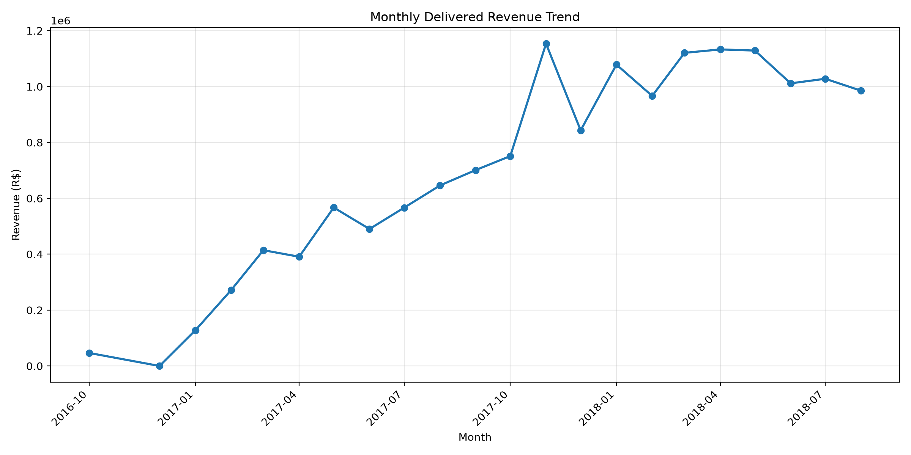
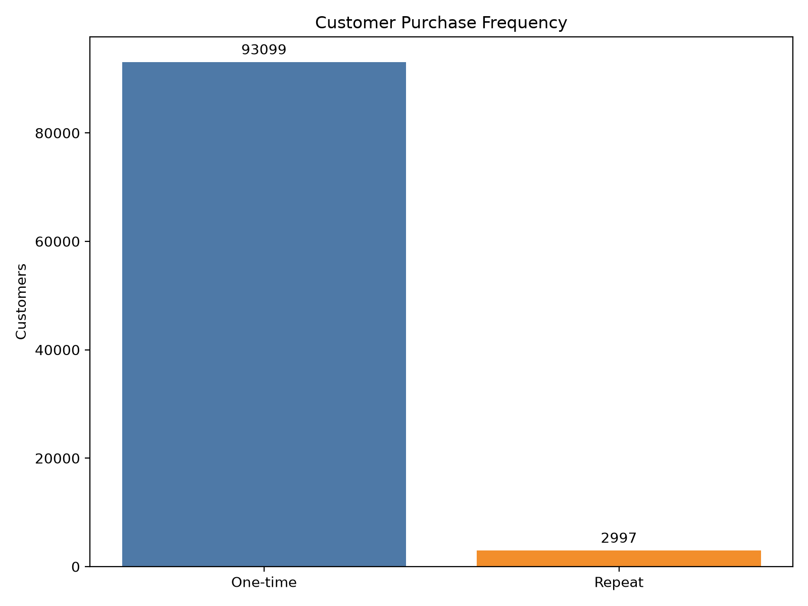
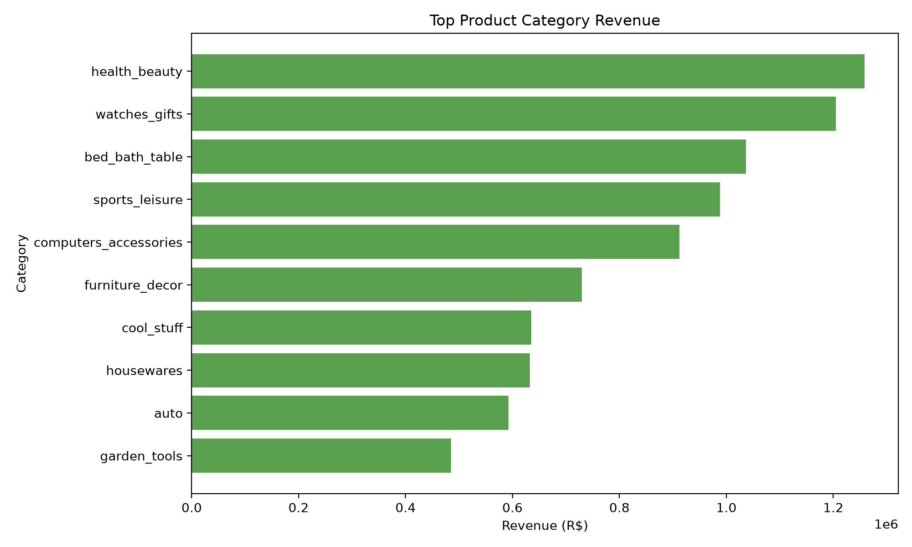
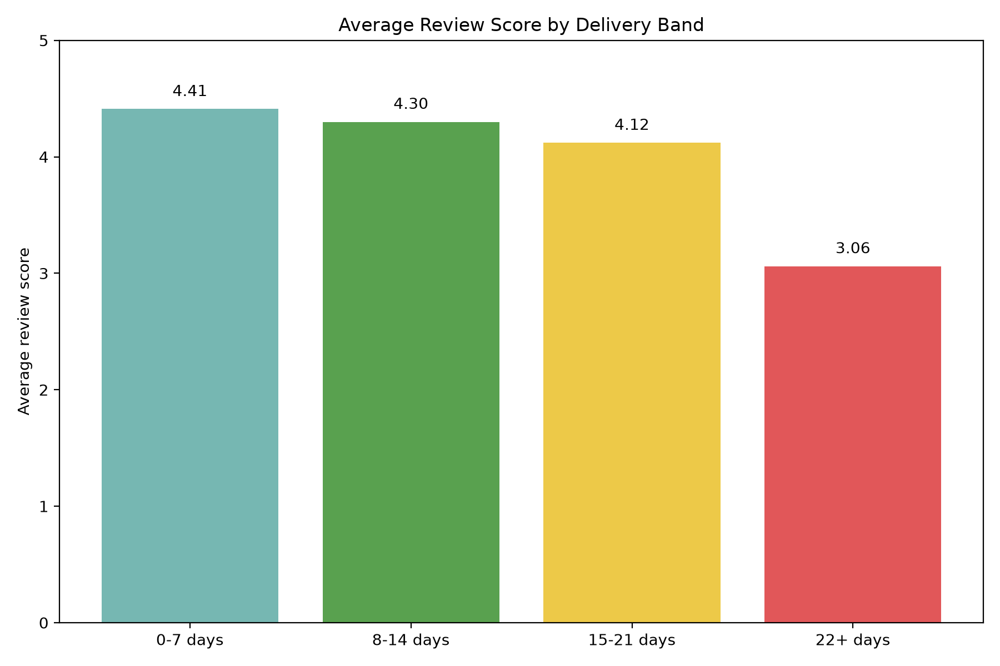

# Olist E-Commerce Analytics — Business Insights

## Executive summary

This document consolidates the verified evidence from the cleaned Olist data, Level 3 EDA, and Level 4 SQL analysis. The core sales KPI is delivered-order payment revenue, while category and seller analysis uses item-level revenue from `order_items.price`. These are not interchangeable metrics and are treated separately here.

> Data note: The analysis below uses actual validated results only. It does not claim profit or margin because the dataset does not contain forward cost information.

---

## 1. Sales Performance

### Finding

[FACT] The delivered-order payment revenue base totals R$15,421,771.48 across 96,475 delivered orders, producing an average order value of R$159.85. This is the project’s core revenue KPI.

[FACT] Revenue is concentrated in a small number of geographies and categories. São Paulo alone generated R$5,769,575.90 in delivered revenue, and the top category revenue lines are led by Health & beauty (R$1,233,131.72), Watches & gifts (R$1,166,056.98), and Bed & bath table (R$1,023,434.76).

[FACT] Monthly delivered revenue peaked at R$1,153,528.05 in November 2017 and was R$985,277.25 in August 2018.

### Investigation

The sales pattern is tested against order-level payment revenue, revenue by customer state, and category contribution using item `price` revenue. This preserves the correct business grain without double counting.

### Insight

[INTERPRETATION] The business has a healthy delivered revenue base, but revenue remains geographically and category-concentrated. São Paulo contributes a material share of order-level revenue, while a few categories dominate item-price revenue. The sales pattern also shows material month-to-month variation, which suggests a need to balance inventory and demand planning around peak periods rather than assuming a flat baseline.

[INTERPRETATION] The difference between delivered-order revenue and category item-price revenue is important: the core business revenue KPI is order payment value, while category mix is measured on item price contribution. Mixing the two without explanation would overstate or misstate economic contribution.

### Recommendation

[RECOMMENDATION] Prioritize inventory, marketing, and regional fulfillment focus on São Paulo and the top revenue categories while keeping a tighter view on seasonal peaks around late 2017. Use category-level planning to protect the strongest product families without over-indexing on one category or one market.

### Business Impact

The likely operational impact is higher sales efficiency: better inventory allocation, simpler regional fulfillment planning, and a more targeted campaign calendar aligned to the strongest revenue periods and geographies.

---

## 2. Customer Analytics

### Finding

[FACT] The customer base contains 96,096 unique customers. Of these, 93,099 are one-time customers and 2,997 are repeat customers, with an average of 1.03 orders per customer.

[FACT] Repeat purchasing is present but still limited in scale; the customer distribution remains heavily skewed toward one-time transactions.

[FACT] The top customer by revenue is a single customer in Rio de Janeiro with R$13,664.08 in revenue across 1 order, while the next customer values are also concentrated in a small number of high-value accounts.

### Investigation

This chain uses the verified customer revenue and purchase-frequency analysis from the customer SQL. The data supports repeat-vs-one-time segmentation, customer frequency bands, and customer value ranking without requiring unsupported assumptions about loyalty program effects.

### Insight

[INTERPRETATION] Customer acquisition is generating a large customer base, but repeat purchase behavior is still underdeveloped relative to the total customer count. This makes revenue more dependent on new customer acquisition than on deepening existing customer relationships.

[INTERPRETATION] The customer value distribution suggests that a small number of customers can materially lift revenue, but the wider portfolio is still dominated by single-purchase behavior. This is a classic retention opportunity rather than a proof of an already-mature loyalty base.

### Recommendation

[RECOMMENDATION] Build retention programs around the repeat-buying segment and convert one-time buyers into second-purchase buyers. Use the top-customer ranking to identify high-value account segments and preserve the highest-value relationship patterns while increasing the conversion rate of lower-frequency buyers.

### Business Impact

The likely impact is improved customer lifetime value and lower dependence on constant acquisition. The business would gain a more durable revenue base if repeat behavior expands without relying on a small number of high-value accounts alone.

---

## 3. Product & Seller

### Finding

[FACT] Product category revenue is concentrated in a few categories. The top item-price revenue categories are Health & beauty (R$1,258,681.34), Watches & gifts (R$1,204,885.68), and Bed & bath table (R$1,036,988.68).

[FACT] Seller performance is also concentrated geographically and by seller. The top seller in the item-price revenue view generated R$229,472.63 in revenue across 1,156 items, with several São Paulo sellers clustering near the top of the ranking.

[FACT] This analysis uses item `price` revenue, not delivered-order payment revenue, so the category and seller story is measured at the right analytical grain for product and assortment questions.

### Investigation

This chain draws on the product and seller SQL and is aligned with the verified item-level revenue logic. It avoids claiming seller quality solely from sales volume; it evaluates revenue concentration, category concentration, and seller mix separately.

### Insight

[INTERPRETATION] The assortment is materially concentrated in a few categories. That can be positive for operational efficiency, but it also creates strategic concentration risk if demand shifts away from these categories or if a category-specific supply issue occurs.

[INTERPRETATION] Seller concentration is not yet evidence of quality alone; it is evidence of commercial concentration. A seller’s revenue can be high because of volume, price, or category mix, and that is not the same as proving superior operational quality.

### Recommendation

[RECOMMENDATION] Protect the strongest category lines with inventory continuity and pricing discipline, while monitoring concentration risk in the top categories. For sellers, focus on partner management and assortment quality rather than assuming high revenue automatically means better performance.

### Business Impact

The likely business impact is stronger assortment control and lower concentration risk. The company can prioritize growth in the strongest categories while managing exposure to a narrow set of seller and product concentration points.

---

## 4. Delivery & Operations

### Finding

[FACT] Delivered orders average 12.50 days from purchase to delivery. Late-delivery rate is 8.11%, or 7,826 late orders out of 96,470 delivered orders.

[FACT] The review-score pattern declines as delivery time increases: 0–7 days averages 4.41, 8–14 days averages 4.30, 15–21 days averages 4.12, and 22+ days averages 3.06.

[FACT] The Pearson correlation between delivery delay and average review score is -0.3341, indicating a negative association between longer delivery time and lower review scores.

### Investigation

This chain uses the delivery SQL, including estimated-vs-actual delivery checks and review-score comparisons by delivery band. The statistical relationship is measured at the order level and does not imply causation.

### Insight

[INTERPRETATION] Delivery performance is generally stable but does worsen in longer fulfillment windows. The delivery-review relationship is not proof that delay caused poor reviews, but it does show a measurable association: longer delays are linked with lower customer feedback.

[INTERPRETATION] Because the late-delivery rate is moderate rather than extreme, the operational opportunity is concentrated in the delayed-order experience rather than in broad failure of the fulfillment network.

### Recommendation

[RECOMMENDATION] Prioritize on-time delivery improvements for the 15–21 day and 22+ day segments, improve ETA management where delays are most likely, and review carrier and fulfillment processes for the highest-risk lanes. Use the score pattern as a service-quality signal, not as proof that delivery is the only driver of customer sentiment.

### Business Impact

The likely impact is improved customer satisfaction and lower operational friction in the highest-risk delivery bands. Better delay management should increase the share of orders delivered within expectations and reduce the negative review pattern associated with extended shipping times.

---

## Final assessment

The verified evidence supports a focused operational and revenue story: the business has a strong delivered revenue base, but it remains geographically and category-concentrated, customer retention is still limited, and delivery performance has a measurable negative relationship with review sentiment. The correct next step is not broad speculation; it is targeted action in the strongest revenue geographies, the highest-value categories, and the delayed-delivery segments that are most likely to affect customer experience.

---

## Chart inventory

- Sales: `charts/sales_revenue_trend.png`
- Customer: `charts/customer_pattern.png`
- Product & Seller: `charts/category_revenue.png`
- Delivery & Operations: `charts/delivery_review_band.png`
